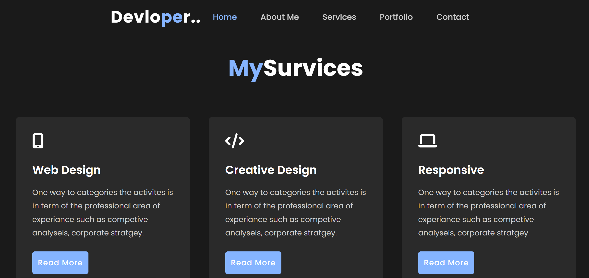

# Personal Portfolio  🚀

## Project Description 📝

> That is a personal Portfolio webpage. that have a main section that contaian all the articles and a navbar section which containe all the ancher tages and a logo picture. have an about, projects, contact us section then we use id selector to reference the specific section to specific links in navbar. This web pages is fully responsive we use @media query that adjust our page in every screen size. this is the main feature of this webpage and it has a greate design. 
>


```css
@media (max-width: 480px) {
  .home-text p {
    font-size: 1rem;
    line-height: 1.4;
  }

  .home-text h1 {
    font-size: 2rem;
    font-weight: 600;
  }

  .home-text h3 {
    font-size: 2rem;
    font-weight: 600;
  }

  .about {
    grid-template-columns: 2fr;
  }

  .contact {
    grid-template-columns: 1fr;
  }

  #menu-icon {
    display: block;
  }

  .navList {
    position: absolute;
    top: -1000px;
    left: 0;
    right: 0;
    display: flex;
    flex-direction: column;
    background: #2a2a2a;
    text-align: left;
    transition: all 0.45s ease;
  }

  .navList a {
    display: block;
    margin: 17px;
    font-size: 20px;
    transition: all 0.45s ease;
    color: #ffff;
  }

  .navList a.active {
    color: #fff;
  }

  .navList a:hover {
    top: 100%;
  }
  
  .navList.open {
    top: 100%;

  }
}


```


## Demo 📸

life demo link [( https://farwamuhibzada.github.io/Personal_Portfolio/)]

how it looks in desktop screen




how it looks in ipad screen


how it looks in smartphone screen


## Technologies Used 🛠️

List the technologies or tools that i used to develop this project. 
- HTML
- CSS


## Installation 💻

for using this project you neet to install 3 things:

- chrombrowser
- an IDE like vscode
- git


## Usage 🎯

for using this project you need to know a few commond first clone the repositry in yor local machine then go to the github directory . open the project on your IDE like vscode and start working on it .


go to the cmd and clone the Technical Documentation Page 
using this commond:
```bash

git clone https://github.com/FarwaMuhibZada/Personal_Portfolio.git 
```
go to the githu directory:
```bash

cd>Personal_Portfolio

```
open the project on your IDE like vscode :

```bash

cd>Personal_Portfolio code .

```


## Features ⭐
- Responsive webpage


## FarwaMuhibzada 👩‍💻


- LinkedIn: [(https://www.linkedin.com/in/farwa-muhibzada/)]
- Email: [(farwafarid2017@gmail.com)]

## Contributing 🤝
For contribution you can create a pull request and mention me there.Thank you.


